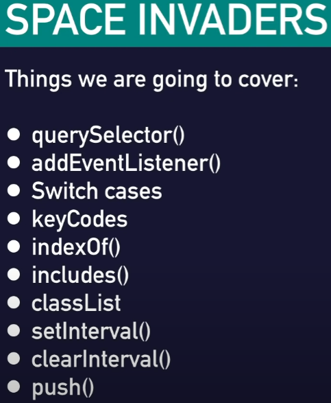

# my-space-invaders

## About
This is the fifth of seven repositories. Each was created with the intended purpose of developing JavaScript skills. Currently, these projects are desktop-based with a final edition being completed for all screen sizes. This project is for practising game development using JavaScript in a web browser.

I am essentially time-bound to a project deadline with Code Institute at the moment of creating these repositories, & my goal is to learn JavaScript as crazily fast as possible. I have experience with Object Orientated languages; I possess the advantage of knowing the fundamentals of 'OO' programming.

I am an ambitious fellow and want to progress rapidly in this industry.

Wish me luck in my endeavours. The time of writing this explanation is the 10th of February 2022.

## content
I used [Free Code Camp](https://www.freecodecamp.org/) to help develop my javascript skills.

This [tutorial](https://www.youtube.com/watch?v=lhNdUVh3qCc&t=605s) was used to create 7 browser based games using javascript.